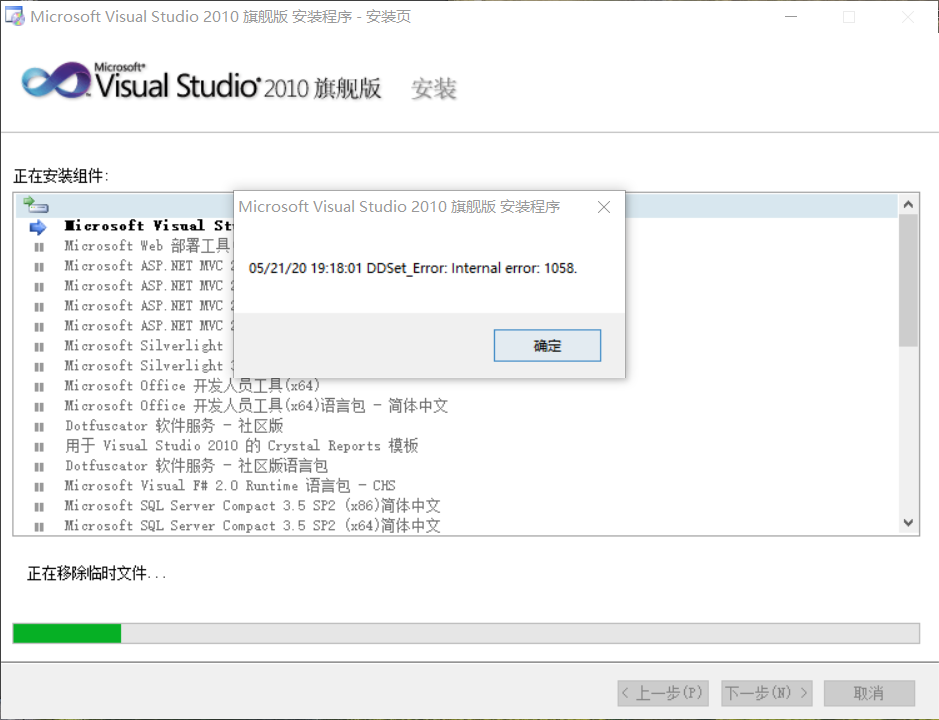
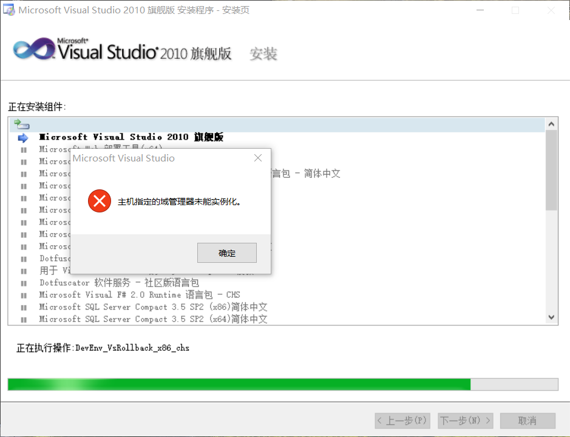
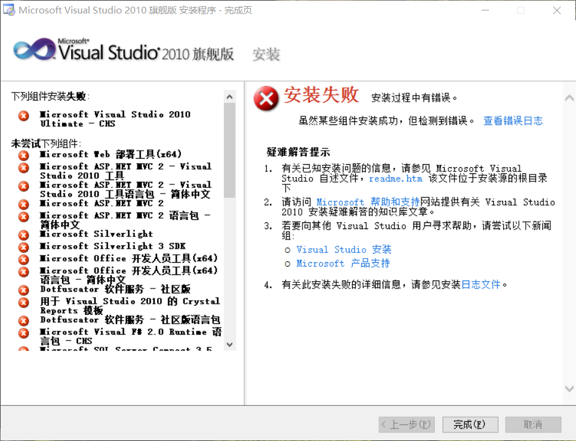
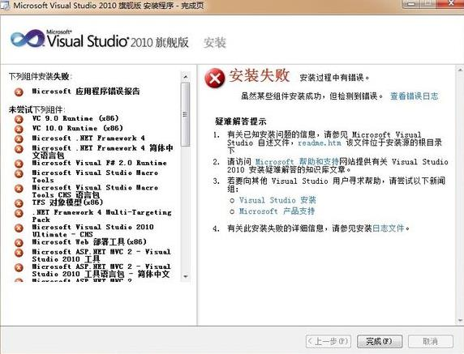
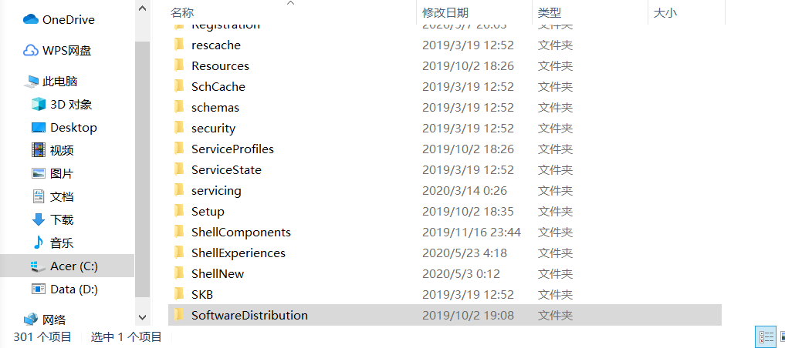

---
关于安装2010 vs旗舰版出现的问题及解决
---
<p>在安装2010 Visual Studio 旗舰版出现了一些问题，现将过程中出现的问题和解决方法分享一下。(ps:所用操作系统为：win10+64)
</p>

## 问题一
### 安装过程报错（如图）：
   

如上图，安装过程中报错：DDSet_error:Internal error :1058 
经在官网上查询发现这个错误是windows的http驱动被禁止了，系统在安装过程中无法通过该驱动服务进行相关http请求，所以出错！

### 解决方法：
    Win+R 打开命令提示符(以管理员运行)，输入以下命令：
**(1)彻底清理上次的安装缓存：**
```bash
$  cd "C:\ProgramData\Package Cache"
$  del /F /S *.msiDelete /F /S *.cab
```
**(2)打开http服务：**
```bash
$  Sc config http start= system
$  net start http
```
**(3)以管理员权限重新安装vs2010即可**

## 问题二
### 安装过程报错(如图)：


如上图，安装过程中报错：Microsoft 应用程序错误报告

### 解决方法：
     Win+R 打开命令提示符(以管理员运行)，输入以下命令：
**(1)停止Windows 更新服务：**
```bash
$  net stop WuAuServ
```
**(2)手动将C盘下的SoftwareDistribution文件删除或者重命名**


**(3)重新启动Windows 更新服务：**
```bash
$  net start WuAuServ 
```
**(4)重新安装即可**

## 小结
    以上我在vs2010旗舰版安装遇到的问题，零零碎碎搞了差不多两天，最后得出一个结论：百度无所不能。遇到问题先百度，我们所遇到的问题，前人差不多都早就走过...


