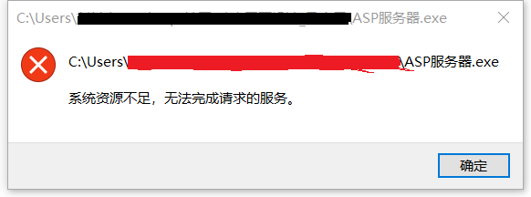

---
在安装ASP服务器中遇到的问题及解决
---

由于课程需要，要安装一个ASP的服务器，但是在安装过程中出现了一个问题...

### 问题如图：

字面意思是说资源不足，百度发现可能情况有：
(1)操作系统开启了太多句柄，重启下计算机，问题可能消失；（句柄数可以看：任务管理器-->性能 ）
(2)如果还是不消失，说明有其他进程占用了资源，比如一些杀毒软件， McAfee或者360杀毒软件什么的，可以尝试去除【或关闭】后重试；
(3)系统配置问题；

### 解决方法：

我所遇到的问题就是上面的第二种情况，是系统自带的McAfree的问题。直接把McAfrree卸载或者暂停里面的服务就可以了。